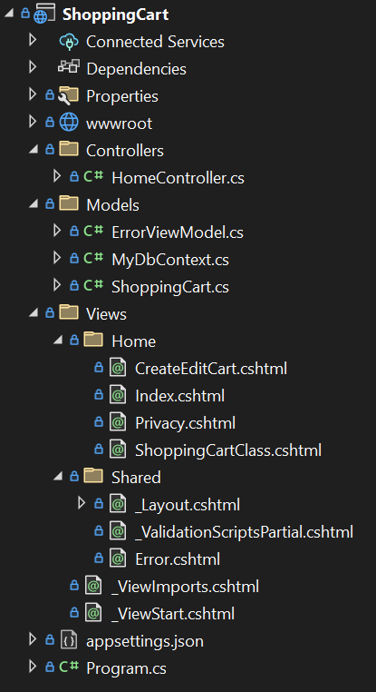
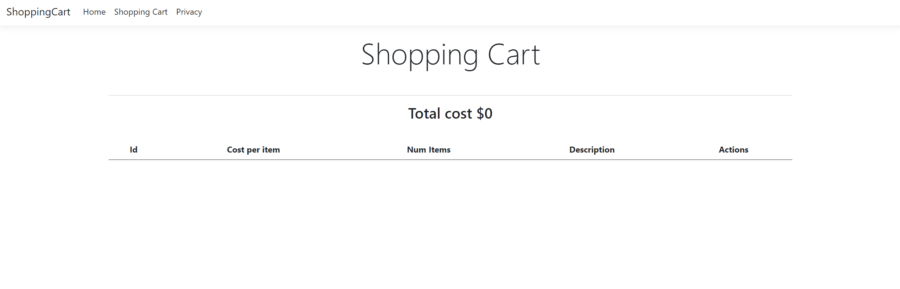
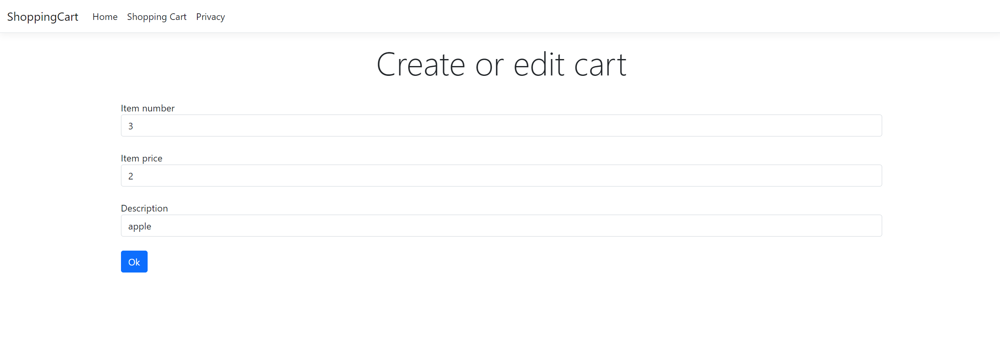
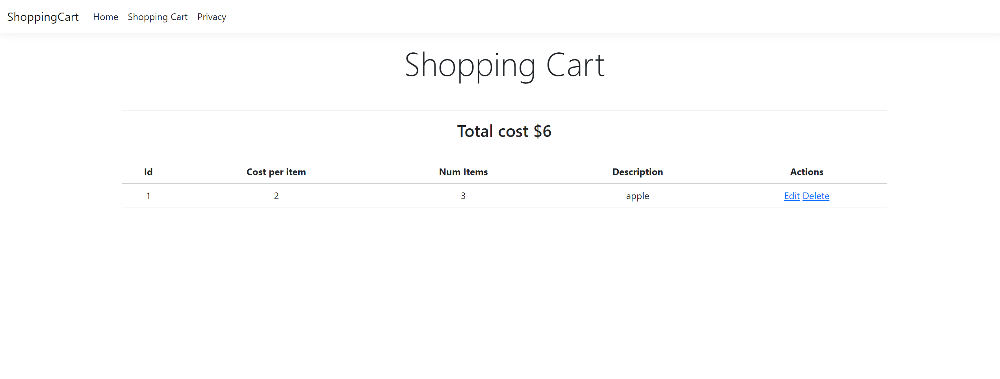
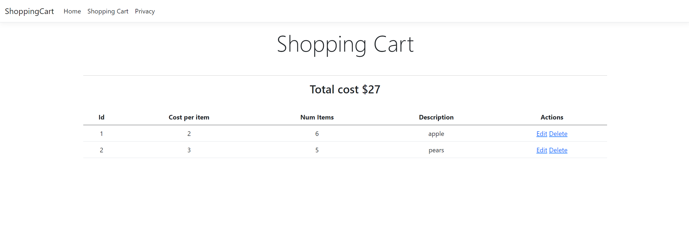

### Shopping Cart Using Model-View-Controller

I decided to learn MVC by creating a simple shopping cart program, where the user writes an item description and chooses the number of items to add to cart. Also, the user can edit item number and descrition, as well as delete an item. The user sees the total price for all items. All changes are written to an Entity Framework DB. MVC is a great design pattern for programs that call for separation of concerns. Model is responsible for data management and interaction with the database. View represents the UI. Controller handles user input and interacts with the Model to update the View.

This is how I organized my project:

Here are a few screenshots to show user interaction with the program:

Viewing the cart before any changes:

Now, we are adding a new item:

This is how the shopping cart looks now:

Let's now add 5 pears and then update the number of apples from 3 to 6:

As you may have noticed, the user chooses not only the number of items, but also the price, which is, although very convenient, is not too realistic. This is something I will fix in the future. In order to fix the issue, we need to connect item description to its price per unit in the database and list the proce to the user. However, since the focus of this mini-project is to learn MVC, I first implemented all vital functions.

